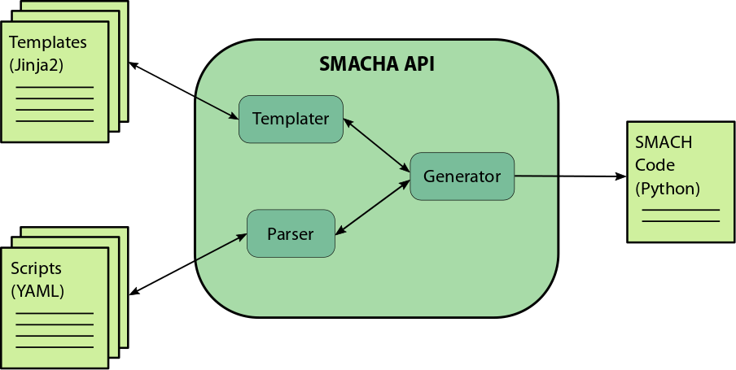

# SMACHA

SMACHA is a [Jinja2](http://jinja.pocoo.org/docs/2.9/) and [YAML](http://yaml.org/)-based
code templating, generation and scripting engine for [SMACH](http://wiki.ros.org/smach).

[SMACH](http://wiki.ros.org/smach) is an exceptionally useful and comprehensive task-level architecture
for state machine construction in [ROS](http://wiki.ros.org/)-based robot control systems.
However, while it provides much in terms of power and flexibility, its overall task-level simplicity
can often be obfuscated at the script-level by boilerplate code, intricate structure and lack
of code reuse between state machine prototypes.

SMACHA (pronounced "smasha") aims at distilling the task-level simplicity of SMACH into compact YAML-based scripts
in the foreground, while retaining all of its power and flexibility in Jinja2-based
templates and a custom code generation engine in the background.

## Overview



## SMACHA Scripts

SMACHA scripts are YAML files that describe how SMACHA should
generate SMACH code. Here is the ["Nesting State Machines" example](http://wiki.ros.org/smach/Tutorials/Nesting%20State%20Machines)
from the [SMACH Tutorials](http://wiki.ros.org/smach/Tutorials) described in a SMACHA script:
```yaml
--- # Nesting State Machines Tutorial SMACHA script.
name: sm_top
template: Base
manifest: smach_tutorials
node_name: smach_example_state_machine
outcomes: [outcome5]
states:
  - BAS:
      template: Bas
      transitions: {outcome3: SUB}
  - SUB:
      template: StateMachine
      outcomes: [outcome4]
      transitions: {outcome4: outcome5}
      states:
        - FOO:
            template: Foo
            transitions: {outcome1: BAR, outcome2: outcome4}
        - BAR:
            template: Bar
            transitions: {outcome1: FOO}
```
This demonstrates a reduction from 80 lines of raw SMACH code to 20 lines of SMACHA script. Nice.


### Base Variables

The base of the script specifies the following variables:

* `name`: a name for the overall state machine,
* `template`: the name of its base template,
* `manifest` (optional): a name for an optional ROS manifest,
* `node_name`: a name for its associated ROS node,
* `outcomes`: a list of its possible outcomes,
* `states`: list of its constituent states.

Each of the states in the base script may, in turn, specify similar variables of
their own, as discussed in the following sub-sections.

### Templates

Each state, including the base, must specify a template from which its respective
code should be generated.  More on that in the [next section](https://repo.ijs.si/reconcell/smacha#jinja2-templating).

### States

States may be specified as lists, specifying their transition order,
and may also be [nested](http://wiki.ros.org/smach/Tutorials/Nesting%20State%20Machines)
as described in the SMACH tutorials using appropriate combinations of
template and states specification as seen in the example above.

### Outcomes

Possible state outcomes may be specified as a list in each state.

### Transitions
Possible state transitions may be specified as a hash/dictionary in each state.

### Remappings
Input-output remappings (not shown in the above example; see the [SMACH User Data Tutorial](http://wiki.ros.org/smach/Tutorials/User%20Data) for more details) may be specified as a hash/dictionary in each state.

## Jinja2 Templating

[Jinja2](http://jinja.pocoo.org/docs/2.9/) is a powerful template engine for Python.
Jinja2 templates are used to specify how code should be
generated from SMACHA scripts.
The `Base` template from the above example is specified in a `Base.jinja` file and looks like this:

```python
#!/usr/bin/env python

import roslib; roslib.load_manifest('smach_tutorials')
import rospy
import smach
import smach_ros




{{ base_header }}


def main():
    rospy.init_node('{{ node_name }}')
   
    
    # Create a SMACH state machine
    {{ name | lower() }} = smach.StateMachine(outcomes=['{{ outcome }}', ])
    
    
    {{ name | lower() }}.userdata.{{ userdatum_key | lower() }} = {{ userdatum_val }}
    
    
    
    
    # Open the container
    with {{ name | lower() }}:
        # Add states to the container
        
        {{ body | indent(8) }}
        
    
    # Execute SMACH plan
    outcome = {{ name | lower() }}.execute()
   
    
    {{ base_footer | indent(4) }}
    

if __name__ == '__main__':
    main()
```

The `Foo` template is specified in a `Foo.jinja` file and looks like this:
```python

# define state Foo
class Foo(smach.State):
    def __init__(self):
        smach.State.__init__(self, 
                             outcomes=['outcome1','outcome2'],
                             input_keys=['foo_counter_in'],
                             output_keys=['foo_counter_out']))
        self.counter = 0

    def execute(self, userdata):
        rospy.loginfo('Executing state {{ name }}')
        if userdata.foo_counter_in < 3:
            userdata.foo_counter_out = userdata.foo_counter_in + 1
        if self.counter < 3:
            self.counter += 1
            return 'outcome1'
        else:
            return 'outcome2'



smach.{{ parent_type }}.add('{{ name }}', Foo(), 
                       transitions={{ '{' }}'{{ outcome }}':'{{ transition }}',
                                    {{ '}' }},
                       remapping={{ '{' }}'{{ state_key }}':'{{ userdata_key }}',
                                  {{ '}' }})




```

### Core Templates

Default core templates are provided for many of the SMACH containers, as well as other
SMACH constructs like action states.

So far, the following core templates are present and functional:

* `Base.jinja`: This is the core base template used for specifying the bare bones of a
a Python SMACH state machine script.

* `StateMachine.jinja`: This is the core template used for inserting a [StateMachine container](http://wiki.ros.org/smach/Tutorials/StateMachine%20container).

* `Concurrence.jinja`: This is the core template used for inserting a [Concurrence container](http://wiki.ros.org/smach/Tutorials/Concurrence%20container).

* `SimpleActionState.jinja`: This is the core template used for inserting a [SimpleActionState](http://wiki.ros.org/smach/Tutorials/SimpleActionState).

* `ServiceState.jinja`: This is the core template used for inserting a [ServiceState](http://wiki.ros.org/smach/Tutorials/ServiceState).


### Core Code Generation Variables and Code Blocks

There are a number of core code generation variables and code blocks present in the core
templates that enable the code generation engine to produce code in the appropriate places.

* `base_header` block: The `base_header` block in a state template is rendered into the `base_header` variable
in the `base_header` block in the base template.

* `header` block: The `header` block in a state template is rendered into the `header` variable
in the `header` block of either its parent template or the base template depending on its nesting depth.

* `body` block: The `body` block in a state template is rendered into the `body` variable in the `body` block
of either its parent state or the base template depending on its nesting depth.

* `footer` block: The `footer` block in a state template is rendered into the `footer` variable in the `footer`
block of either its parent template or the base template depending on its nesting depth
(not currently implemented in the above example).

* `base_footer` block: The `base_footer` block in a state template is rendered into the `base_footer` variable
in the `base_footer` block of the base template.

Note that all of the above code generation variables and code blocks may be either
removed, modified or arbitrarily customized within the API for particular use-cases.
The code insertion order may also be specified within the API, i.e. code may be either
prepended or appended to a variable.

### Overriding Core Templates, Variables and Blocks via Template Inheritance

Jinja2 provides powerful template functionality, including the ability to extend templates
via [template inheritance](http://wiki.ros.org/smach/Tutorials/SimpleActionState),
such that their constituent code blocks may be overridden or extended as required.
SMACHA aims to incorporate as much of this functionality as possible,
thus the core templates may be overridden or augmented by custom user-specified templates 
via the usual Jinja2 template inheritance mechanisms, with some caveats.

This works in the usual way using the following Jinja2 variables and expressions:

* ``: When this expression appears at the top of a template,
the template will inherit from the template specified by `<template_name>`.

* `{{ super() }}`: When this expression appears inside a block, the code from the same block
specified by the parent template will be rendered at its position in the child template.

Caveats: if a state template contains blocks, but does not contain an `{{ extends }}` expression at
the top of a template, it is implied that the code for the blocks will be rendered into
variables and blocks with the same names as the blocks in the state template as dictated
by the SMACHA script and as defined usually either by the base template or container templates.
This behaviour is specific to SMACHA and is not present in Jinja2.
See the [Core Code Generation Variables and Code Blocks Section](#core-code-generation-variables-and-code-blocks)
for examples of how this behaviour works with core code generation variables and blocks.

See the [Usage Section](#Usage) below for an example of how such custom templates may be
included when generating code via the command-line in practice.


## Code Generation Engine

The SMACHA code generator is a Python API that recursively processes SMACHA scripts,
manages Python code templates, and renders them to Python SMACH code.

The API can either be imported and used in Python projects or invoked as a command-line
script via `rosrun`.

A ROS wrapper may eventually be written to allow the generator to be launched as a ROS
node that exposes services and generates SMACH code over ROS topics, but this has not yet
been implemented.


## Installation

Simply clone into the `src` directory of your catkin workspace and run `catkin_make` from the
root of the workspace.


## Usage
In the simplest case, using default core templates, SMACHA can be invoked on a `my_script.yml`
SMACHA script file as follows:
```
rosrun smacha smacha my_script.yml
```
where the generated code will be output to a file called `smacha_output.py`

Example usage for the "Nesting State Machines" tutorial:
```
roscd smacha/test
rosrun smacha smacha smachaml/executive_smach_tutorials/state_machine_nesting2.yml -t templates/executive_smach_tutorials -o state_machine_nesting2.py -v
```
Here, the `-t` argument specifies custom template directories for this particular tutorial,
which may contain templates that override the core templates.

The `-o` argument specifies a custom name for the generated output file.

The `-v` argument tells SMACHA to print verbose processing output to the terminal.

Further arguments and options may be explored by running `rosrun smacha smacha -h` or `rosrun smacha smacha --help`.

## Testing
Tests may be performed by running:
```
roscd smacha/test
```
followed by
```
nosetests executive_smach_tutorials.py
```
or
```
python executive_smach_tutorials.py
```

Passing the `-h` argument as follows will bring up a list of some other options:
```
python executive_smach_tutorials.py -h
```
Passing the `-w` argument will write the generated output files to disk, which can subsequently be run as follows, e.g. for the `state_machine_nesting2.py` example:
```
rosrun smacha state_machine_nesting2.yml.py
```
To run the original file script, use the following command:
```
rosrun smacha state_machine_nesting2.py
```


## Contributors
SMACHA is developed and maintained by [Barry Ridge](https://barog.net/).


## Acknowledgements
SMACHA was developed for the [EU H2020 ReconCell Project](http://www.reconcell.eu/).
With thanks to [Minija Tamošiūnaitė](http://www.dpi.physik.uni-goettingen.de/cns/index.php?mact=Profilliste,cntnt01,default,0&cntnt01what=Mitarbeiter&cntnt01alias=Tamosiunaite&cntnt01returnid=65) for design contributions.
