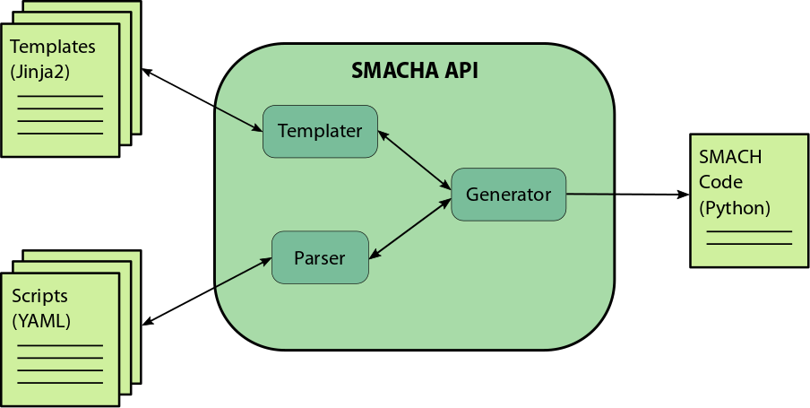

.. SMACHA documentation master file, created by
   sphinx-quickstart on Mon Dec  4 10:52:58 2017.
   You can adapt this file completely to your liking, but it should at least
   contain the root `toctree` directive.

SMACHA Package Documentation
============================

.. toctree::
   :maxdepth: 2
   :caption: Contents:

SMACHA is a `YAML <http://yaml.org/>`__ and
`Jinja2 <http://jinja.pocoo.org/docs/2.9/>`__-based meta-scripting,
templating, and code generation engine for
`SMACH <http://wiki.ros.org/smach>`__.

`SMACH <http://wiki.ros.org/smach>`__ is an exceptionally useful and
comprehensive task-level architecture for state machine construction in
`ROS <http://wiki.ros.org/>`__-based robot control systems. However,
while it provides much in terms of power and flexibility, its overall
task-level simplicity can often be obfuscated at the script-level by
boilerplate code, intricate structure and lack of code reuse between
state machine prototypes.

SMACHA (short for "State Machine Assembler", pronounced "smasha") aims
at distilling the task-level simplicity of SMACH into compact YAML-based
scripts in the foreground, while retaining all of its power and
flexibility in Jinja2-based templates and a custom code generation
engine in the background.

Overview
--------

   SMACHA API Overview

SMACHA Scripts
--------------

SMACHA scripts are YAML files that describe how SMACHA should generate
SMACH code. Here is the `"Nesting State Machines"
example <http://wiki.ros.org/smach/Tutorials/Nesting%20State%20Machines>`__
from the `SMACH Tutorials <http://wiki.ros.org/smach/Tutorials>`__
described in a SMACHA script:

.. literalinclude:: ../test/smacha_scripts/executive_smach_tutorials/state_machine_nesting2.yml
    :linenos:
    :language: yaml

This demonstrates a reduction from 80 lines of raw SMACH code to 15
lines of SMACHA script. Nice.

Base Variables
~~~~~~~~~~~~~~

The base of the script specifies the following variables:

-  ``name``: a name for the overall state machine,
-  ``template``: the name of its base template,
-  ``manifest`` (optional): a name for an optional ROS manifest,
-  ``node_name``: a name for its associated ROS node,
-  ``outcomes``: a list of its possible outcomes,
-  ``states``: list of its constituent states.

Each of the states in the base script may, in turn, specify similar
variables of their own, as discussed in the following sub-sections.

States
~~~~~~

Each state, including the base, must specify a template from which its
respective code should be generated. States may be specified as lists
specifying their transition order and may also be
`nested <http://wiki.ros.org/smach/Tutorials/Nesting%20State%20Machines>`__
as described in the SMACH tutorials using appropriate combinations of
template and state specifications as seen in the example above.

Outcomes
^^^^^^^^

Possible state outcomes may be specified as a list in the base state
machine and in each container state.

Transitions
^^^^^^^^^^^

Possible state transitions may be specified as an associative array
(hash/dictionary) in each state.

Remappings
^^^^^^^^^^

Input and output remappings of user data (not shown in the above
example; see the `SMACH User Data
Tutorial <http://wiki.ros.org/smach/Tutorials/User%20Data>`__ for more
details) may be specified as an associative array in each state.

Jinja2 Templating
-----------------

`Jinja2 <http://jinja.pocoo.org/docs/2.9/>`__ is a powerful template
engine for Python. Jinja2 templates are used to specify how code should
be generated from SMACHA scripts. The ``Base`` template from the above
example is specified in a ``Base.tpl`` file and looks like this:

.. literalinclude:: ../src/smacha/templates/Base.tpl
    :linenos:
    :language: jinja

Core Templates
~~~~~~~~~~~~~~

SMACHA provides default core templates for many of the SMACH states and
containers, as well as for other useful constructs.

So far, the following core templates are present and functional:

-  ``Base.tpl``: the core base template used for specifying the bare
   bones of a a Python SMACH state machine script.

-  ``State.tpl``: contains functionality common to all states, e.g.
   userdata specification.

-  ``StateMachine.tpl``: the core template used for inserting a
   `StateMachine
   container <http://wiki.ros.org/smach/Tutorials/StateMachine%20container>`__.

-  ``Concurrence.tpl``: the core template used for inserting a
   `Concurrence
   container <http://wiki.ros.org/smach/Tutorials/Concurrence%20container>`__.

-  ``ServiceState.tpl``: the core template used for inserting a
   `ServiceState <http://wiki.ros.org/smach/Tutorials/ServiceState>`__.

-  ``SimpleActionState.tpl``: the core template used for inserting a
   `SimpleActionState <http://wiki.ros.org/smach/Tutorials/SimpleActionState>`__.

-  ``TF2ListenerState.tpl``: used for reading TF2 transforms.

Core Code Generation Variables and Code Blocks
~~~~~~~~~~~~~~~~~~~~~~~~~~~~~~~~~~~~~~~~~~~~~~

There are a number of core code generation variables and code blocks
present in the core templates that enable the code generation engine to
produce code in the appropriate places.

-  ``base_header`` block: used to specify any code that must appear near
   the top of the program script.

-  ``defs`` block: used to position function definitions.

-  ``class_defs`` block: used to position class definitions.

-  ``main_def`` block: used to position the main function definition.

-  ``header`` block: the ``header`` block in a state template is
   rendered into the ``header`` variable of either its parent template
   or the base template depending on its nesting depth.

-  ``body`` block: The ``body`` block in a state template is rendered
   into the ``body`` variable of either its parent state or the base
   template depending on its nesting depth.

-  ``footer`` block: The ``footer`` block in a state template is
   rendered into the ``footer`` variable of either its parent template
   or the base template depending on its nesting depth.

-  ``execute`` block: used to position the code necessary for executing
   the state machine.

-  ``base_footer`` block: used to specify any code that must appear near
   the bottom of the program script.

-  ``main`` block: used to specify the code necessary to execute the
   main function.

Some additional blocks may be optionally included, such as the
*introspection\_server* and ROS *spin* blocks, if an introspection
server is required for use with the SMACH viewer, or *comment* blocks,
used to decorate the generated source code.

Note that all of the above code generation variables and code blocks may
be either removed, modified or arbitrarily customized within the API for
particular use-cases. The code insertion order may also be specified
within the API, i.e. code may be either prepended or appended to a
variable.

Overriding Core Templates, Variables and Blocks via Template Inheritance
~~~~~~~~~~~~~~~~~~~~~~~~~~~~~~~~~~~~~~~~~~~~~~~~~~~~~~~~~~~~~~~~~~~~~~~~

Jinja2 provides powerful template functionality, including the ability
to extend templates via `template
inheritance <http://wiki.ros.org/smach/Tutorials/SimpleActionState>`__,
such that their constituent code blocks may be overridden or extended as
required. SMACHA aims to incorporate as much of this functionality as
possible, thus the core templates may be overridden or augmented by
custom user-specified templates via the usual Jinja2 template
inheritance mechanisms, with some caveats.

This works in the usual way using the following Jinja2 variables and
expressions:

-  ````: When this expression appears at
   the top of a template, the template will inherit code blocks from the
   parent template specified by ``<template_name>``.

-  ``{{ super() }}``: When this expression appears inside a block, the
   code from the same block in the parent template as specified by
   ```` will be rendered at its position.

-  ````: When this expression appears at
   the top of a template, the template will include all code from the
   template specified by ``<template_name>``.

Caveats: if a state template contains blocks, but does not contain an
``{{ extends }}`` expression at the top of a template, it is implied
that the code for the blocks will be rendered into variables and blocks
with the same names as the blocks in the state template as dictated by
the SMACHA script and as defined usually either by the base template or
container templates. This behaviour is specific to SMACHA and is not
present in Jinja2. In the current implementation, only base templates
use the ```` inheritance mechanism, whereas state and
container templates use the ```` mechanism to inherit code
from other templates. See the `Core Code Generation Variables and Code
Blocks Section <#core-code-generation-variables-and-code-blocks>`__ for
examples of how this behaviour works with core code generation variables
and blocks.

See the `Usage Section <#Usage>`__ below for an example of how such
custom templates may be included when generating code via the
command-line in practice.

Code Generation Engine
----------------------

The SMACHA code generator is a Python API that recursively processes
SMACHA scripts, manages Python code templates, and renders them to
Python SMACH code.

The API can either be imported and used in Python projects or invoked as
a command-line script via ``rosrun``.

A ROS wrapper may eventually be written to allow the generator to be
launched as a ROS node that exposes services and generates SMACH code
over ROS topics, but this has not yet been implemented.

Installation
------------

Dependencies
~~~~~~~~~~~~

SMACHA relies on
`ruamel.yaml <https://pypi.python.org/pypi/ruamel.yaml>`__ for YAML
parsing, and ruamel is not available as a system package under Ubuntu
Trusty or below, thus rosdep will not install the package on ROS Jade or
Indigo. It may still be possible to install ruamel on Trusty/Jade or
Trusty/Indigo using pip, but this has not been tested. Kinetic and Lunar
installations should work fine, however.

Install
~~~~~~~

Simply clone into the ``src`` directory of your catkin workspace and run
``catkin_make`` or ``catkin build`` from the root of the workspace. It
may be necessary to update dependencies using ``rosdep`` as follows:

::

    rosdep update
    rosdep install smacha

Usage
-----

In the simplest case, using default core templates, SMACHA can be
invoked on a ``my_script.yml`` SMACHA script file as follows:

::

    rosrun smacha generate my_script.yml

where the generated code will be output to a file called
``smacha_output.py``

Example usage for the "Nesting State Machines" tutorial:

::

    roscd smacha/test
    rosrun smacha generate smacha_scripts/executive_smach_tutorials/state_machine_nesting2.yml -t smacha_templates/executive_smach_tutorials -o state_machine_nesting2.py -v

Here, the ``-t`` argument specifies custom template directories for this
particular tutorial, which may contain templates that override the core
templates.

The ``-o`` argument specifies a custom name for the generated output
file.

The ``-v`` argument tells SMACHA to print verbose processing output to
the terminal.

Further arguments and options may be explored by running
``rosrun smacha generate -h`` or ``rosrun smacha generate --help``.

Testing
-------

Tests may be performed by running:

::

    roscd smacha/test

followed by

::

    nosetests executive_smach_tutorials.py

or

::

    python executive_smach_tutorials.py

Passing the ``-h`` argument as follows will bring up a list of some
other options:

::

    python executive_smach_tutorials.py -h

Passing the ``-w`` argument will write the generated output files to
disk, which can subsequently be run as follows, e.g. for the
``state_machine_nesting2.py`` example:

::

    rosrun smacha state_machine_nesting2.yml.py

To run the original file script, use the following command:

::

    rosrun smacha state_machine_nesting2.py

Contributors
------------

SMACHA is developed and maintained by `Barry
Ridge <https://barog.net/>`__.

Acknowledgements
----------------

SMACHA was developed for the `EU H2020 ReconCell
Project <http://www.reconcell.eu/>`__. With thanks to `Minija
Tamošiūnaitė <http://www.dpi.physik.uni-goettingen.de/cns/index.php?mact=Profilliste,cntnt01,default,0&cntnt01what=Mitarbeiter&cntnt01alias=Tamosiunaite&cntnt01returnid=65>`__
for design contributions.

.. |Build Status| image:: https://travis-ci.org/ReconCell/smacha.svg?branch=master
   :target: https://travis-ci.org/ReconCell/smacha

Indices and tables
==================

* :ref:`genindex`
* :ref:`modindex`
* :ref:`search`
