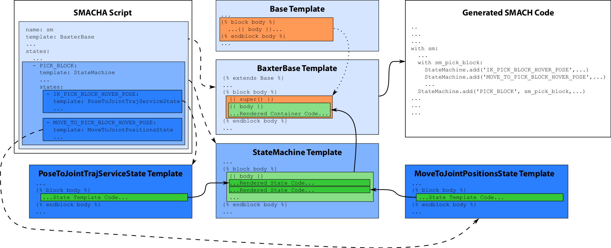

SMACHA Code Generator 
---------------------

The SMACHA code generator is a Python API that recursively processes
SMACHA scripts, manages Python code templates, and renders them to
Python SMACH code.

The API can either be imported and used in Python projects or invoked as
a command-line script via ``rosrun``.

A ROS wrapper may eventually be written to allow the generator to be
launched as a ROS node that exposes services and generates SMACH code
over ROS topics, but this has not yet been implemented.
