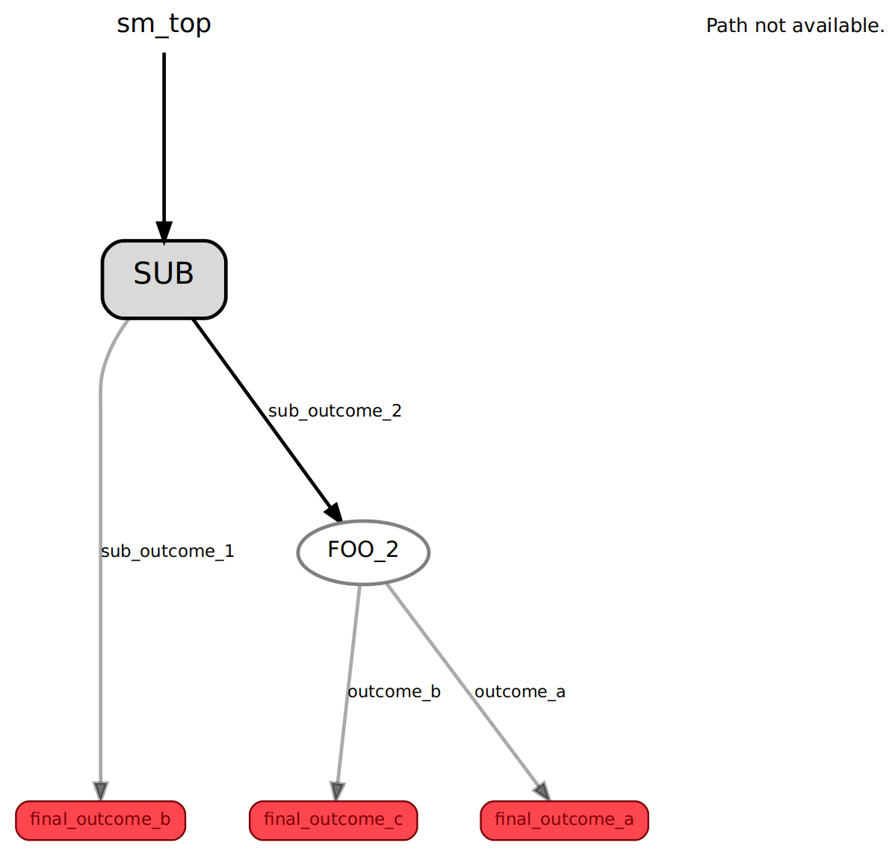
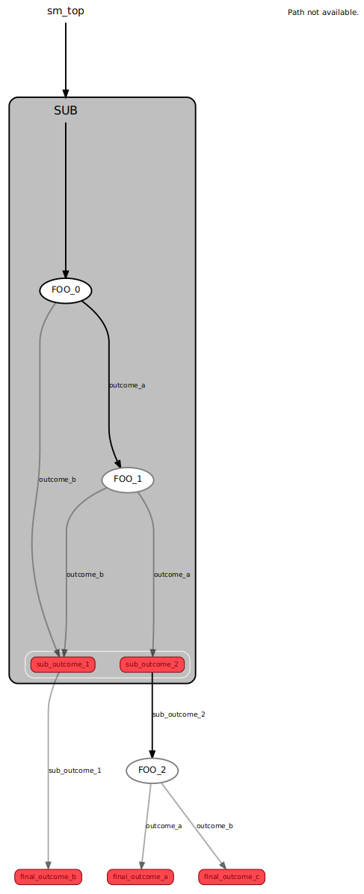
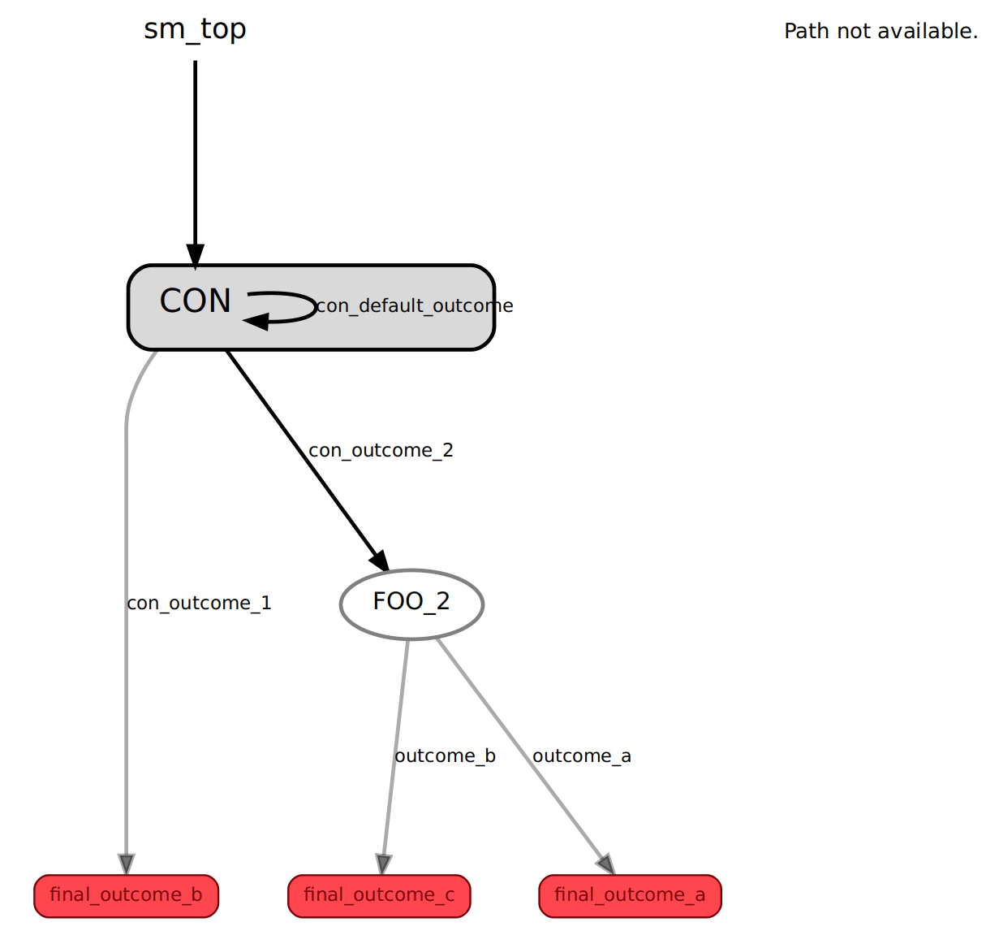
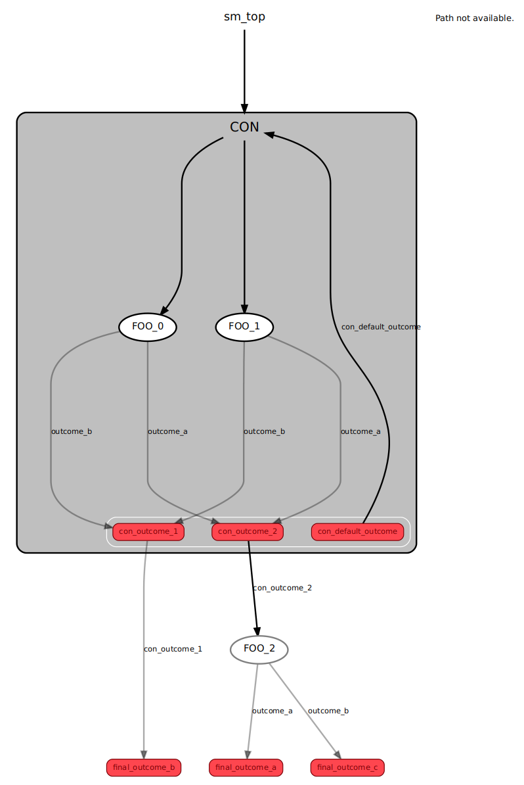

****************
Container States
****************

.. toctree::

**NOTE**: Before reading the following documentation, it is highly recommended
that you consult the
`"Create a Hierarchical State Machine" <https://wiki.ros.org/smach/Tutorials/Create%20a%20hierarchical%20state%20machine>`__
and
`"Concurrent State Machine" <https://wiki.ros.org/smach/Tutorials/Concurrent%20States>`__
SMACH tutorials first!

**Container states** are special types of states that
allow for state constructions to extend beyond linear state sequences.
SMACHA uses two types of container states: **StateMachine**
containers and **Concurrence** containers, for producing
nested state machine hierarchies and parallel state machines respectively.

Nested State Machine Example
============================

Here is a simple SMACHA script from the ``test/smacha_scripts/smacha_test_examples``
folder in the ``smacha`` package that uses a `StateMachine` container to
define a nested state hierarchy:

.. code-block:: yaml

  # SMACHA state sequence example
  name: sm_top
  template: Base
  manifest: smacha
  node_name: smacha_params_test
  outcomes: [final_outcome_a, final_outcome_b, final_outcome_c]
  states:
  - SUB:
      template: StateMachine
      params: {name: FOO_0, outcome: outcome_a, name_1: FOO_1}
      outcomes: [sub_outcome_1, sub_outcome_2]
      transitions: {sub_outcome_1: final_outcome_b, sub_outcome_2: FOO_2}
      states:
      - FOO_0:
          template: ParamFoo
          name_param: [params, name]
          outcome_param: [params, outcome]
          transitions: {outcome_a: FOO_1, outcome_b: sub_outcome_1}
      - FOO_1:
          template: ParamFoo
          name_param: [params, name_1]
          outcome_param: [params, outcome]
          transitions: {outcome_a: sub_outcome_2, outcome_b: sub_outcome_1}
  - FOO_2:
      template: ParamFoo
      params: {name: FOO_2, outcome: outcome_a}
      name_param: [params, name]
      outcome_param: [params, outcome]
      transitions: {outcome_a: final_outcome_a, outcome_b: final_outcome_c}

If we execute this script by running the following command in one terminal:

::

   rosrun smacha execute -t `rospack find smacha`/test/smacha_templates/smacha_test_example -i -v `rospack find smacha`/test/smacha_scripts/smacha_test_examples/seq_nesting_1.yml

and run `smach_viewer` from the `executive_smach_visualization
<http://wiki.ros.org/executive_smach_visualization>`__ package in another
terminal:

::

   rosrun smach_viewer smach_viewer.py

we get the following visualization of the resulting state machine:

.. table:: Nested state machine example visualized at two different depth levels.

  +---------+---------+
  | |pic1|  | |pic2|  |
  +---------+---------+

Concurrent State Machines
=========================

Here is a simple SMACHA script from the ``test/smacha_scripts/smacha_test_examples``
folder in the ``smacha`` package that uses a `Concurrence` container to
define state machines that run in parallel:

.. code-block:: yaml

  # SMACHA state sequence example
  name: sm_top
  template: Base
  manifest: smacha
  node_name: smacha_params_test
  outcomes: [final_outcome_a, final_outcome_b, final_outcome_c]
  states:
  - CON:
      template: Concurrence
      params: {name: FOO_0, outcome: outcome_a, name_1: FOO_1}
      outcomes: [con_outcome_1, con_outcome_2, con_default_outcome]
      default_outcome: con_default_outcome
      outcome_map: {con_outcome_1: {FOO_0: outcome_b, FOO_1: outcome_b}, con_outcome_2: {FOO_0: outcome_a, FOO_1: outcome_a}}
      transitions: {con_outcome_1: final_outcome_b, con_outcome_2: FOO_2, con_default_outcome: CON}
      states:
      - FOO_0:
          template: ParamFoo
          name_param: [params, name]
          outcome_param: [params, outcome]
      - FOO_1:
          template: ParamFoo
          name_param: [params, name_1]
          outcome_param: [params, outcome]
  - FOO_2:
      template: ParamFoo
      params: {name: FOO_2, outcome: outcome_a}
      name_param: [params, name]
      outcome_param: [params, outcome]
      transitions: {outcome_a: final_outcome_a, outcome_b: final_outcome_c}

If we execute this script by running the following command in one terminal:

::

   rosrun smacha execute -t `rospack find smacha`/test/smacha_templates/smacha_test_example -i -v `rospack find smacha`/test/smacha_scripts/smacha_test_examples/seq_concurrence_1.yml

and run `smach_viewer` from the `executive_smach_visualization
<http://wiki.ros.org/executive_smach_visualization>`__ package in another
terminal:

::

   rosrun smach_viewer smach_viewer.py

we get the following visualization of the resulting state machine:

.. table:: Concurrent state machines example visualized at two different depth levels.

  +---------+---------+
  | |pic3|  | |pic4|  |
  +---------+---------+

The Contain Tool
================

Since it can be cumbersome to convert linear state sequences to nested `StateMachine`
container states or parallel `Concurrence` container states, either in SMACHA YAML
script or, indeed, in raw SMACH Python code, SMACHA provides a utility
called the **contain tool** in order to automate this process.

In order to illustrate how it works, in the following, we will use the 
``seq.yml`` script from the ``test/smacha_scripts/smacha_test_examples``
folder in the ``smacha`` package familiar from the previous sections
that defines a linear sequence of states:

.. code-block:: yaml

  --- # SMACHA state sequence example
  name: sm_top
  template: Base
  manifest: smacha
  node_name: smacha_params_test
  outcomes: [final_outcome_a, final_outcome_b, final_outcome_c]
  states:
    - FOO_0:
        template: ParamFoo
        params: {name: FOO_0, outcome: outcome_a}
        name_param: [params, name]
        outcome_param: [params, outcome]
        transitions: {outcome_a: FOO_1, outcome_b: final_outcome_b}
    - FOO_1:
        template: ParamFoo
        params: {name: FOO_1, outcome: outcome_a}
        name_param: [params, name]
        outcome_param: [params, outcome]
        transitions: {outcome_a: FOO_2, outcome_b: final_outcome_b}
    - FOO_2:
        template: ParamFoo
        params: {name: FOO_2, outcome: outcome_a}
        name_param: [params, name]
        outcome_param: [params, outcome]
        transitions: {outcome_a: final_outcome_a, outcome_b: final_outcome_c}

StateMachine Containerization Example
-------------------------------------

In order to convert the ``FOO_0, FOO_1, FOO_2`` sequence in the above script into
a script with a `StateMachine` state named ``SUB`` containing the sequence ``FOO_0, FOO_1`` followed by ``FOO_2``,
we run the following command:

::

   rosrun smacha contain `rospack find smacha`/test/smacha_scripts/smacha_test_examples/seq.yml SUB StateMachine FOO_0 FOO_1 -o seq_nesting_1.yml

that produces the following result in the `seq_nesting_1.yml` generated output file:

.. code-block:: yaml

  # SMACHA state sequence example
  name: sm_top
  template: Base
  manifest: smacha
  node_name: smacha_params_test
  outcomes: [final_outcome_a, final_outcome_b, final_outcome_c]
  states:
  - SUB:
      template: StateMachine
      params: {name: FOO_0, outcome: outcome_a, name_1: FOO_1}
      outcomes: [sub_outcome_1, sub_outcome_2]
      transitions: {sub_outcome_1: final_outcome_b, sub_outcome_2: FOO_2}
      states:
      - FOO_0:
          template: ParamFoo
          name_param: [params, name]
          outcome_param: [params, outcome]
          transitions: {outcome_a: FOO_1, outcome_b: sub_outcome_1}
      - FOO_1:
          template: ParamFoo
          name_param: [params, name_1]
          outcome_param: [params, outcome]
          transitions: {outcome_a: sub_outcome_2, outcome_b: sub_outcome_1}
  - FOO_2:
      template: ParamFoo
      params: {name: FOO_2, outcome: outcome_a}
      name_param: [params, name]
      outcome_param: [params, outcome]
      transitions: {outcome_a: final_outcome_a, outcome_b: final_outcome_c}

which should match the nested state machine example above.

Concurrence Containerization Example
------------------------------------

In order to convert the ``FOO_0, FOO_1, FOO_2`` sequence in the ``seq.yml`` script into
a script with a `Concurrence` state named ``CON`` containing the parallel states ``FOO_0`` and  ``FOO_1`` followed by ``FOO_2``,
we run the following command:

::

   rosrun smacha contain `rospack find smacha`/test/smacha_scripts/smacha_test_examples/seq.yml CON Concurrence FOO_0 FOO_1 -o seq_concurrence_1.yml

that produces the following result in the `seq_concurrence_1.yml` generated output file:

.. code-block:: yaml

  # SMACHA state sequence example
  name: sm_top
  template: Base
  manifest: smacha
  node_name: smacha_params_test
  outcomes: [final_outcome_a, final_outcome_b, final_outcome_c]
  states:
  - CON:
      template: Concurrence
      params: {name: FOO_0, outcome: outcome_a, name_1: FOO_1}
      outcomes: [con_outcome_1, con_outcome_2, con_default_outcome]
      default_outcome: con_default_outcome
      outcome_map: {con_outcome_1: {FOO_0: outcome_b, FOO_1: outcome_b}, con_outcome_2: {FOO_0: outcome_a, FOO_1: outcome_a}}
      transitions: {con_outcome_1: final_outcome_b, con_outcome_2: FOO_2, con_default_outcome: CON}
      states:
      - FOO_0:
          template: ParamFoo
          name_param: [params, name]
          outcome_param: [params, outcome]
      - FOO_1:
          template: ParamFoo
          name_param: [params, name_1]
          outcome_param: [params, outcome]
  - FOO_2:
      template: ParamFoo
      params: {name: FOO_2, outcome: outcome_a}
      name_param: [params, name]
      outcome_param: [params, outcome]
      transitions: {outcome_a: final_outcome_a, outcome_b: final_outcome_c}

which should match the concurrent state machines example above.
