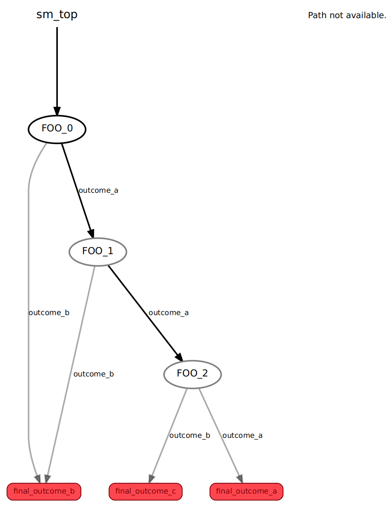

**************
SMACHA Scripts
**************

.. toctree::

**NOTE**: Before reading the following documentation, it is highly recommended
that you consult the `"Getting Started with smach" SMACH Tutorial <https://wiki.ros.org/smach/Tutorials/Getting%20Started>`__
first!

**SMACHA scripts** are YAML files that describe how SMACHA should generate
SMACH code.

Linear State Sequence Example
=============================

Here is a simple SMACHA script from the ``test/smacha_scripts/smacha_test_examples``
folder in the ``smacha`` package that defines a linear sequence of states:

.. code-block:: yaml

  --- # SMACHA state sequence example
  name: sm_top
  template: Base
  manifest: smacha
  node_name: smacha_params_test
  outcomes: [final_outcome_a, final_outcome_b, final_outcome_c]
  states:
    - FOO_0:
        template: ParamFoo
        params: {name: FOO_0, outcome: outcome_a}
        name_param: [params, name]
        outcome_param: [params, outcome]
        transitions: {outcome_a: FOO_1, outcome_b: final_outcome_b}
    - FOO_1:
        template: ParamFoo
        params: {name: FOO_1, outcome: outcome_a}
        name_param: [params, name]
        outcome_param: [params, outcome]
        transitions: {outcome_a: FOO_2, outcome_b: final_outcome_b}
    - FOO_2:
        template: ParamFoo
        params: {name: FOO_2, outcome: outcome_a}
        name_param: [params, name]
        outcome_param: [params, outcome]
        transitions: {outcome_a: final_outcome_a, outcome_b: final_outcome_c}

If we execute this script by running the following command in one terminal:

::

   rosrun smacha execute -t `rospack find smacha`/test/smacha_templates/smacha_test_example -i -v `rospack find smacha`/test/smacha_scripts/smacha_test_examples/seq.yml

and run `smach_viewer` from the `executive_smach_visualization
<http://wiki.ros.org/executive_smach_visualization>`__ package in another
terminal:

::

   rosrun smach_viewer smach_viewer.py

we get the following visualization of the resulting state machine:

We will now take a look at the different parts of the script in more detail below.

Base Variables
==============

The base of the script specifies the following variables:

-  ``name``: a name for the overall state machine,
-  ``template``: the name of its base template,
-  ``manifest`` (optional): a name for an optional ROS manifest,
-  ``node_name``: a name for its associated ROS node,
-  ``outcomes``: a list of its possible outcomes,
-  ``states``: list of its constituent states.

Each of the states in the base script may, in turn, specify similar
variables of their own, as discussed in the following sub-sections.

These variables are used to fill out the ``Base`` template (as selected
by the ``template`` variable) which looks like this:

.. code-block:: python

  

  
  

  
  #!/usr/bin/env python
  {{ base_header }}
  

  
  import roslib; roslib.load_manifest('{{ manifest }}')
  import rospy
  import smach
  import smach_ros
  {{ imports }}
  

  
  {{ defs }}
  

  
  {{ class_defs }}
  

  

  
  def {{ function_name | lower() }}main():
      rospy.init_node('{{ node_name }}{{ name }}')

      {{ main_def | indent(4) }}
  

  
      {{ sm_name }} = smach.StateMachine({{ render_outcomes(outcomes) }})

      {{ render_userdata(name | lower(), userdata) | indent(4) }}
      {{ header[name] | indent(4, true) }}

      with {{ sm_name }}:

          {{ body | indent(8) }}
  

  
          {{ footer | indent(8) }}
  

  
      sis = smach_ros.IntrospectionServer('{{ node_name }}{{ name }}', {{ name | lower() }}, '/{{ name }}')
      sis.start()
  

  
      {{ execute | indent(4) }}

      outcome = {{ sm_name }}.execute()
      

     
      rospy.spin()
  

  
      {{ base_footer | indent(4) }}
  

  
  if __name__ == '__main__':
  {{ '' | indent(4, true) }}{{ function_name | lower() }}main()
  

Without getting bogged down in :doc:`templating
<../Templating/smacha_templates>` details, this just defines the skeleton of a
SMACH Python code file. All we need to understand at this point is that the
remainder of our SMACHA script is used alongside other templates in order to
populate this template and produce the final executable result.

States
======

State sequences are specified as `lists` of `key: value` pairs
in which the `key` represents the state name and the `value`
specifies further `key:value` pairs that fill out state variables.
For further information on YAML syntax see
`here <https://en.wikipedia.org/wiki/YAML>`__ or `here <http://yaml.org/>`__.

Looking at the first state in the above example:

.. code-block:: yaml

  - FOO_0:
      template: ParamFoo
      params: {name: FOO_0, outcome: outcome_a}
      name_param: [params, name]
      outcome_param: [params, outcome]
      transitions: {outcome_a: FOO_1, outcome_b: final_outcome_b}

we can see that the state is named ``FOO_0`` and that it specifies the variables
``template``, ``params``, ``name_param``, ``outcome_param`` and ``transitions``.
Each state must specify the ``template`` variable indicating the template from
which its respective code should be generated. The presence or absence of other
state variables is entirely dependent on how that template is specified.
However, because of the adherence to the SMACH state machine specification,
there are many variables that are consistently present in all or most state
templates. We will discuss these in more detail in subsequent sections.
In this case, the template is the ``ParamFoo`` template located in
the ``test/smacha_templates/smacha_test_examples`` folder of the ``smacha`` package,
and it looks like this:

.. code-block:: python

  

  
  
  # define state Foo
  class Foo(smach.State):
      def __init__(self, name, outcome):
          smach.State.__init__(self, outcomes=['outcome_a','outcome_b'])

          self._name = name
          self._outcome = outcome

      def execute(self, userdata):
          rospy.loginfo('Executing state {}'.format(self._name))
          rospy.loginfo('Returning {}'.format(self._outcome))

          return self._outcome
  
  

  
  smach.{{ parent_type }}.add('{{ name }}', Foo('{{ name_param }}', '{{ outcome_param }}'), 
  {{ render_transitions(transitions) }},
  {{ render_remapping(remapping) }})
  

While all of the template variables are important for filling out the template,
the ``transitions`` variable is one of the most important ones and it should be
present in all state templates since it specifies how the state machine should
flow between states. In the above example, the ``FOO_0`` state specifies that if
it results in ``outcome_a``, then the state machine should transition to the
``FOO_1`` state, whereas if it results in ``outcome_b``, then the state machine
should transition to ``final_outcome_b``.

States can be constructed as 
`nested state hierarchies <http://wiki.ros.org/smach/Tutorials/Nesting%20State%20Machines>`__
using :doc:`container states <container_states>` or can import
:doc:`sub-scripts <sub_scripts_and_super_scripts>` containing previously
written state sequences or hierarchies.
In both of these cases `script parameters`, which are present in the above
example, provide important functionality, which we discuss next.

Script Parameters
=================

Script parameters allow for variables to be defined and passed around
`at the script level` without being interfering with the templates.
This is important for passing values between container states and
sub-scripts.

The ``FOO_0`` state from the above example includes script parameter
definitions for illustrative purposes, but it could just as easily
have been defined without them, while achieving the same result, as follows:

.. code-block:: yaml

  - FOO_0:
      template: ParamFoo
      name_param: FOO_0
      outcome_param: outcome_a
      transitions: {outcome_a: FOO_1, outcome_b: final_outcome}

In this simplified case, the `template variables` ``name_param`` and ``outcome_param``
are filled `at the template level` with the values ``FOO_0`` and ``outcome_a``
respectively.

Looking again at the original ``FOO_0`` state that includes the `script
parameters`,

.. code-block:: yaml

  - FOO_0:
      template: ParamFoo
      params: {name: FOO_0, outcome: outcome_a}
      name_param: [params, name]
      outcome_param: [params, outcome]
      transitions: {outcome_a: FOO_1, outcome_b: final_outcome_b}

we see that the line ``params: {name: FOO_0, outcome: outcome_a}`` defines two
script parameters ``name`` and ``outcome`` that are given the values ``FOO_0``
and ``outcome_a`` respectively. Then, in the subsequent line ``name_param:
[params, name]``, when the script is parsed, the ``[params, name]`` list
construction will be substituted for the ``FOO_0`` value before being passed to
the template, effectively resulting in ``name_param: FOO_0`` as before.
Similarly, the line ``outcome_param: [params, outcome]`` means that ``[params,
outcome]`` will be substitute with the ``outcome`` parameter value, i.e.
``outcome_a``.
We refer to this functionality as a `parameter lookup` and the associated
API method in the :doc:`Parser Module <../API/smacha.parser>`
is documented :func:`here <smacha.parser.Parser.lookup>`.

**NOTE**: both of the above state definitions result in precisely the same
outcome `at the template level`!  The utility of this script parameter
functionality will become more clear later when we discuss the use of
:doc:`container states <container_states>` and
:doc:`sub-scripts <sub_scripts_and_super_scripts>`.

String Constructs
=================

It can sometimes be useful combine script parameters with other
script parameters or strings in order to form more complex
expressions via concatenation.
For example, if the script parameters ``subject``, ``verb``
and ``object`` contained the values ``I``, ``having`` and ``day``
respectively, then we can form the construction
``[[params, subject], 'am', [params, verb], 'a bad', [params, object]]``,
which would be parsed as ``I am having a bad day``.
In SMACHA, we refer to these as `string constructs`.
Here is a simple example of how they are used:

.. code-block:: yaml

  - FOO_1:
      template: ParamFoo
      params: {name: FOO, outcome: outcome}
      name_param: [[params, name], '_1']
      outcome_param: [[params, outcome], '_b']
      transitions: {outcome_a: FOO_1, outcome_b: final_outcome}

Here, the line ``name_param: [[params, name], '_1']`` uses a string construct

``name_param``.  Since the ``name`` parameter contains the value ``FOO``,
this string construct is parsed as ``FOO_1``.
Similarly, the string construct in ``outcome_param: [[params, outcome], '_b']``
resolves to ``outcome_b``.

The associated API method for parsing string constructs
in the :doc:`Parser Module <../API/smacha.parser>`
is documented :func:`here <smacha.parser.Parser.construct_string>`.
