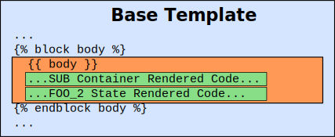
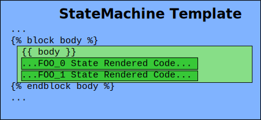
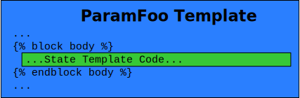
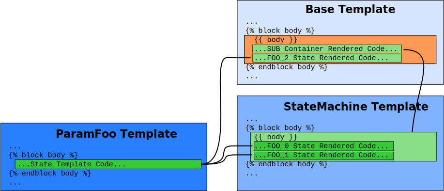

****************
SMACHA Templates
****************

.. toctree::

.. note:: Before reading the following documentation, particularly if you are
          unfamiliar with templating, it is highly recommended that you consult
          the `"Jinja2 documentation <http://jinja.pocoo.org/>`__ first!

**SMACHA templates** are used to specify how SMACH Python code should be
generated from SMACHA scripts. They are effectively code skeletons with
placeholder variables that are fleshed out with the contents of the scripts via
the recursive code generation process. The SMACHA API renders these templates
using the `Jinja2 <http://jinja.pocoo.org/docs/2.9/>`__ library, a powerful
template engine for Python, coupled with some custom modifications to its usual
rendering behaviour in order to suit this particular use case.

There are several different template types in SMACHA:

- **Base templates**: these form the base of the final output SMACH Python
  script (the `"spine"`),
- **Container templates**: these render SMACH container states (the `"bones"`),
- **State templates**: these render regular SMACH states (the `"meat"`),
- **Other templates**: these usually provide useful utilities to help with
  rendering the other states (the `"nerves"`).

It will be illustrative to get a quick overview of the base, container
and state templates before describing their contents, interrelationships and
the rendering process in more detail.

Base Templates
==============

All SMACHA scripts start by specifying a **base template**,
which is like the `"spine"` of the code skeleton that serves as a
starting point from which the code generation process can start
to fill in the meat of the code.

Looking again at the :download:`seq_nesting_1.yml
</../test/smacha_scripts/smacha_test_examples/seq_nesting_1.yml>` script from the
:ref:`Nested State Machine Example <nested-state-machine-example>` in the
:doc:`Container States Scripting Tutorial <../Scripting/container_states>`,
we see that the base template ``Base`` is specified at the top of the script:

.. literalinclude:: /../test/smacha_scripts/smacha_test_examples/seq_nesting_1.yml
   :language: yaml
   :lines: 1-7

This ``Base`` template is the :doc:`core SMACHA Base template <../API/Templates/Base.tpl.py>`
defined in the :download:`Base.tpl.py </../src/smacha/templates/Base.tpl.py>` file.

.. note:: The `.tpl.py` extension indicates that it is a template, while still
          allowing text editors to invoke their Python syntax highlighters.

As shall be described in more detail in the :doc:`template anatomy <anatomy>`
section, SMACHA templates contain many **blocks** and **code insertion
variables**. The blocks are wrapped in ```` and ```` tags, while the code insertion variable for the
corresponding block carries the same name as the block and is placed in a ``{{
my_block }}`` tag. For the purposes of this introduction, if we imagine for a
moment that the :doc:`core Base template <../API/Templates/Base.tpl.py>` only
contains the ``body`` block and corresponding ``{{ body }}`` code insertion variable,
then it might look like this:

         renderings appended beneath its ``{{ body }}`` variable.

with the following code for the block definition:

.. literalinclude:: /../src/smacha/templates/Base.tpl.py
   :language: python
   :lines: 65-74

The core idea behind SMACHA :doc:`code generation
<../CodeGeneration/smacha_code_generator>` and :ref:`template rendering
<recursive-rendering>` is that as SMACHA scripts are traversed,
the various blocks in the templates associated with the states therein are
rendered into their corresponding code insertion variables in the corresponding
blocks in their parent state templates (which could be either base templates
or container templates).

Container Templates
===================

SMACHA scripts can make use of :doc:`Container States <../Scripting/container_states>`
by employing **container templates**,
which are a bit like the `"bones"` that connect to the `"spine"` of the ``Base`` template
forming the structural support for ``State`` template renderings that form the `"meat"`
of the final rendered code.

In the :download:`seq_nesting_1.yml
</../test/smacha_scripts/smacha_test_examples/seq_nesting_1.yml>` script,
we can see a ``StateMachine`` container template being specified in order to
render the ``SUB`` state:

.. literalinclude:: /../test/smacha_scripts/smacha_test_examples/seq_nesting_1.yml
   :language: yaml
   :lines: 8-13

This is the :doc:`core SMACHA StateMachine container template
<../API/Templates/StateMachine.tpl.py>` defined in the
:download:`StateMachine.tpl.py </../src/smacha/templates/StateMachine.tpl.py>`
file. Again, if we imagine that it just contains the ``body`` block and
corresponding ``{{ body }}`` code insertion variable, then it might look like
this:

         from the ``FOO_0`` and ``FOO_1`` state renderings appended beneath its
         ``{{ body }}`` variable.

with the following code for the block definition:

.. literalinclude:: /../src/smacha/templates/StateMachine.tpl.py
   :language: python
   :lines: 36-51

Container templates play a dual role as both the parents of child states,
where the contents of the child state ``body`` blocks get rendered into their
``{{ body }}`` code insertion variable, and as the children of parent states,
where the contents of their ``body`` blocks (including whatever gets rendered
into their ``{{ body }}`` variable their children) gets rendered into the
``{{ body }}`` variable of their parent.

State Templates
===============

Finally, the `"meat"` of the rendered output code is made up of regular
``State`` templates.

In the :download:`seq_nesting_1.yml
</../test/smacha_scripts/smacha_test_examples/seq_nesting_1.yml>` script,
we can see a ``ParamFoo`` state template being specified in order to
render both the ``FOO_0`` and ``FOO_1`` states in the  ``SUB`` container state,
as well as the ``FOO_2`` state that follows:

.. literalinclude:: /../test/smacha_scripts/smacha_test_examples/seq_nesting_1.yml
   :language: yaml
   :lines: 24-29

This ``ParamFoo`` template is a simple example state from the 
`test/smacha_scripts/smacha_test_examples <https://gitlab.com/reconcell/smacha/tree/master/smacha/test/smacha_scripts/smacha_test_examples>`__
folder in the `smacha <https://gitlab.com/reconcell/smacha/tree/master/smacha>`__ package
defined in the :download:`ParamFoo.tpl.py </../test/smacha_templates/smacha_test_examples/ParamFoo.tpl.py>` file.

Another way to imagine these state templates (other than as `"meat"`) is as
the `"leaves"` of the overall state machine `"tree"`. Once we hit the leaf states,
they can no longer be parent states themselves, so they no longer contain code
insertion variables and the code generation process renders the contents of
their blocks and starts recursing back up the tree, inserting those rendered
blocks into their parent code insertion variables on the way up.

.. _recursive-rendering:

Recursive Rendering
===================

Putting all of the above together, we can finally see the how the overall
recursive rendering process functions in SMACHA:

         Machine Example <nested-state-machine-example>`.

.. important:: The nature of this rendering process **differs significantly from
   standard Jinja2 template rendering**, which does not use scripts to determine
   the rendering order and thus does not contain the concept of "code insertion
   variables". This particular behaviour is specific to SMACHA. Jinja2 does,
   however, allow for `template inheritance
   <http://jinja.pocoo.org/docs/2.10/templates/#template-inheritance>`__,
   something that SMACHA also makes use of, as we shall see in :doc:`a later
   section <inheritance>`.
